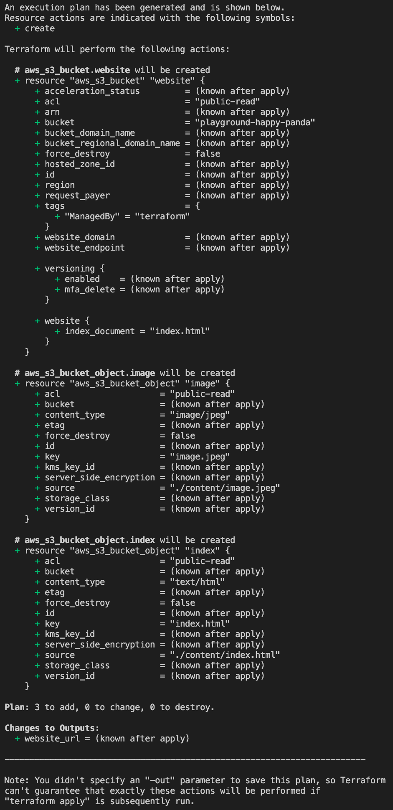

# Deploying static website using S3

## User story
Hello DevOps team! We are working on groundbreaking idea which our marketing team is already promoting. Front-end team desinged a simple static page with the launch date. Can we deploy it for yesterday? Oh - frogot to say, budget is not approved yet so there is no budget. Thanks.

## Approach
Our requirements are not well defined yet, but we need to act quick. We do not want to make too many assumptions because we do not know yet what is going to come, and we do not have any money to spend. Let's do it as simple as possible while keeping it easy to change and expand.
We are going to use S3 bucket to store our static content and we are going to use terraform to make our life easier in the future.

## Let's do it
### Step one: Create the bucket and add our website!
As you probably noticed we have a directory called `content` with a mysterious `index.html` file. This will be a marvelous website we will be deploying. There is also a `image.jpeg` which we need to include. The file is not complexed and looks like below:
```html
<html>
    <head>
        <style>
            .center {
              margin: auto;
              width: 70%;
              padding: 10px;
              text-align: center;
            }
        </style>
    </head>
    <body>
        <div class="center">
            
            <h1>Under construction - Stay tuned!</h1>
            <h2>We are launching 25.03.2021</h2>
        </div>
    </body>
</html>
```
It looks like we have an easy job here. All we need to do is to ship it to the cloud!
First we need to create an S3 bucket which will host our website. Let's go to the `main.tf` file in our `lab_1` directory and add the configuration below.
```go
resource "aws_s3_bucket" "website" {
  bucket = "playground-${var.my_panda}.devopsplayground.org"
  acl    = "public-read"

  tags = {
    ManagedBy = "terraform"
  }
  website {
    index_document = "index.html"
  }
}
```
Looks pretty simple, but you probably notice a scary `$` annoucing interpolated variable. S3 buckets need to be unique across the whole AWS so we need to make sure that we are not trying to create one which is already there. Each lucky participant of today's workshop should have his own instance with the unique Panda. Let's create `variables.tf` file in our `lab_1` directory and add our unique pande there.
It should look more or less like below:
```go
variable "my_panda" {
  default = "YOUR-UNIQUE-PANDA"
  description = "The name of your panda (provided with environment) i.e. happy-panda"
}
```
Finally - let's add the files to our newly created S3 bucket. We can use terraform to do that too. Let's go back to our `main.tf` file and add the following
```go
resource "aws_s3_bucket_object" "index" {
  bucket       = aws_s3_bucket.website.id
  key          = "index.html"
  source       = "./content/index.html"
  acl          = "public-read"
  content_type = "text/html"
}
resource "aws_s3_bucket_object" "image" {
  bucket       = aws_s3_bucket.website.id
  key          = "image.jpeg"
  source      = "./content/image.jpeg"
  acl          = "public-read"
  content_type = "image/jpeg"
}
```
Lastly, just for our conviniece let's add an usefull output to our configuration. For that purpouse let's create `output.tf` file in our `lab_1` directory and add the follwoing:
```go
output "website_url" {
  value = aws_s3_bucket.website.website_endpoint
}
```
Looks like we got it! On the provided workstation `terraform` is already installed and configured so all we need to do is to run:
```
terraform init
```
which will download the appropriate provider and shortly after hit
```
terraform plan
```
You should see the resources which will be created if you apply the configuration

If it looks like the one above - go ahead and type
```
terraform apply
```
and confirm the plan by typing `yes`. After a few seconds you should see the url of your new website like below.


Lets try to visit it!


That was easy. Looks like we have our first success and everyone likes it. Just when we are about to call it a day we are getting this beauty:

## User story 2
```
Hello DevOps team! Everything looks awesome but damn this url will never fit my business card! Can you do something about it?
```
### Step 2: Create route53 record pointing to our website.
Thankfully we have a domain and hosted zone we can use. You might even be familiar with it by now! Yes - `devopsplayground.org` is what we are looking for. Let's create a simple CNAME record so we can meet the requirements above! We need to have a look on our `main.tf` file and use data source to get our hosted zone details.
```golang
data "aws_route53_zone" "main" {
  name         = "devopsplayground.org"
  private_zone = false
}
```
And create a new record for our website (also in our `main.tf`)
```golang
resource "aws_route53_record" "link" {
  zone_id = data.aws_route53_zone.main.zone_id
  name    = "playground-${var.my_panda}"
  type    = "CNAME"
  ttl     = "300"

  records = [aws_s3_bucket.website.website_endpoint]
}
```
Finally let's update `output.tf` so we can see our newly created url once we hit apply!
```golang
output "route53_record" {
  value = aws_route53_record.link.fqdn
}
```
Once the file is saved, let's hit `terraform apply` and if everything looks good confirm it with `yes`

Let's check if our website works as expected and if so let's clean-up by executing `terraform destroy` followed by `yes`

**Note**: This website is not as impressive as it would be if the actual front-end team would work on it, but in fact it was all DevOps work hence it is a bit of an eyesore. It is about deploying, not designing today! You can always throw some JavaScript or React to make it beatiful.

**Note2**: S3 Static hosting does not support HTTPS access, nevertheless you can use Cloudfront to serve S3 hosted static website over the HTTPS. We are trying to build and deploy 3 Tier application in under an hour so we will skip that today :) 

**Note3**: Those of you who attended our terraform workshops will probably ask - when are we going to turn it into a handy module? Well - terraform is not our main focus today, but that is exactly what we would do with a little more time :)

### Documentation
https://registry.terraform.io/providers/hashicorp/aws/latest/docs/resources/s3_bucket
https://registry.terraform.io/providers/hashicorp/aws/latest/docs/resources/s3_bucket_object
https://registry.terraform.io/providers/hashicorp/aws/latest/docs/resources/route53_record

Let's move to the next lab and see what poor DevOps team need to do next :) 

[Next - Deploying application backend and creating API](../lab_2/README.md)