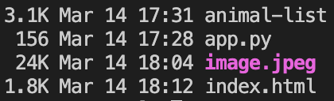

# Deploying application backend and creating API
## User story

Hello DevOps team! I know we promised to keep you on the loop, but things were a little hectic recently and not everything went according to the plan. We can reveal that our amazing service will find your spiritual animal - awesome right? Well, there is one problem tho. Our sofisticated algorithym is not ready yet and we kind of promised that we will launch the service today.Backend team desinged a python function which will find a spiritual animal for our customers for now. It is not what we intended to deliver, but it is what we can deliver. Ups almost forgot - can we deliver it somehow? Frontend is ready, backend is ready - could you guys tie it toegheter somehow? You probably guessed that by now, but just to be clear - budget is still not approved! I am sure you can make it!


## Note from the frontend team

Hey guys - We are not responsible for making APIs so we left invocation URL blank for now but the rest is there for you - just plug it in!


## Note from the backend team

Hey guys, we are still working on approved animals list, but you should have the latest version of it in animal-list.txt file. Just make sure it is on whatever server you are running our code as environment variable called "ANIMALS". Our sofisticated code will do the rest. Works on my machine!


## Approach
Now we have a python function to deploy, new frontend and if that wouldn't be enough we need to desing an API which will make those two working. We also need to remember to have an environment variable to be present on our server. We can most likely reuse our configuration from the previous lab to deploy the front end. For the backend with no budget? I say, lets go serverless and use lambda which supports python runtime, especially with such a small function (see `app.py`). Once we got those two ready we can create API gateway triggering our function and it should work!
## Lets do it

### Step one: Deploy the static frontend, again...
We know from our frontend team that we will need to add API invocation URL to the file but apart from that we should be good to go! Lets have a peak on our brand new html file.
```html
...
    <script type="text/javascript">         
    function submitToAPI(e) {
        e.preventDefault();
        var URL = "API is not our job to do...";
        var name = $("#name").val();
        var data = {
          "name" : name
        };

       $.ajax({
         type: "POST",
         url : "API is not our job to do...",
         dataType: "json",
         contentType: "application/json; charset=utf-8",
         data: JSON.stringify(data),

         
        success: function(response) {
            document.getElementById("form-response").innerHTML = "Your spiritual animal is " + response["animal"];
        },
         error: function (request, error) {
            console.log(arguments);
            alert(" Can't do because: " + error);
    }});
     }
    </script>
...
```
The lovely `"API is not our job to do..."` strikes us straight away, but lets do not worry about it just yet - we will get to that. Apart from this little detail we should be able to deploy it using our precious work from the previous lab! Recycling at its finest! We should get an error while submiting the form, but we are getting somewhere :)
Configuration from the previous lab is already in `main.tf`, just add your panda to `variables.tf` and make sure you ran `terraform destroy` on previous workspace (lab_1)
```go
variable "my_panda" {
  default     = "YOUR-PANDA"
  description = "The name of your panda (provided with environment) i.e. happy-panda"
}
```
We need to run in our `lab_2` directory
```
terraform init
```
```
terraform apply
```

### Step two: Deploy our backend code
Lets have a look on what our backend team brought to the table. DevOps team is definitely not as skilled in python, but maybe we can make something out of it.
```python
import os
import random

ANIMALS = os.environ['ANIMALS'].split(",")

def spiritual_animal_finder():
    animals = ANIMALS
    response = {
        "animal": random.choice(animals)
    }
    return response

def lambda_handler(event, context):
    return spiritual_animal_finder()


```
Wow! - Hope that our sophisticated algorithm will be a little more complicated. There must be pretty big presure to release this... That is definitely a great fit for a Lambda function. Pretty sure we are far away from 15 minutes execution time limit.
We also need to provide environment variable which is a string included in `animal-list.txt`. Lambda function is supporting environment variables no bigger than 4KB. Lets have a look if that is not an issue for us.

Lets type `ls -al` in our `content` directory and check



Uff - 3.1KB - lets hope that we will not get many more animals approved!

Lets build our lambda function, we will need to add to our `main.tf` in `lab_2` directory:
```golang
data "archive_file" "lambda_zip" {
  type        = "zip"
  source_file = "./content/app.py"
  output_path = "./content/${var.my_panda}.zip"
}

resource "aws_lambda_function" "main" {
  filename      = data.archive_file.lambda_zip.output_path
  function_name = "playground-${var.my_panda}"
  role          = aws_iam_role.lambda_role.arn
  handler       = "app.lambda_handler"
  timeout       = 180
  source_code_hash = filebase64sha256(data.archive_file.lambda_zip.output_path)

  runtime = "python3.7"
  environment {
    variables = var.env_vars
  }
  tags = {
    "Owner" = "playground-${var.my_panda}"
  }
}
```
We also need to add code below to the `variables.tf` file and add string from `content/animal-list.txt` as a value of ANIMALS:
```golang
variable "env_vars" {
  type        = map(string)
  default = {
      ANIMALS = "use animals from animal-list.txt"
  }
  description = "The enviroment variables for the function"
}
```
And create an IAM role for the function:
```golang
resource "aws_iam_role" "lambda_role" {
  name = "playground-${var.my_panda}"
  assume_role_policy = jsonencode({
    Version = "2012-10-17"
    Statement = [
      {
        Action = "sts:AssumeRole"
        Effect = "Allow"
        Sid    = ""
        Principal = {
          Service = "lambda.amazonaws.com"
        }
      },
    ]
  })

  tags = {
    "Owner" = "playground-${var.my_panda}"
  }
}
```
## Documentation
https://registry.terraform.io/providers/hashicorp/aws/latest/docs/resources/lambda_function
https://registry.terraform.io/providers/hashicorp/archive/latest/docs/data-sources/archive_file
https://docs.aws.amazon.com/lambda/latest/dg/welcome.html
### Create an API
Now we need to tie it all together and create an API. We will use AWS API Gateway to do so and here is what we need to add to our configuration (`main.tf`):
Create an API
```golang
resource "aws_api_gateway_rest_api" "api" {
  name        = "playground-${var.my_panda}-api"
  description = "The api gateway for ${var.my_panda}"
  endpoint_configuration {
    types = ["REGIONAL"]
  }
}
```
Then we need to create a method for our website 
https://registry.terraform.io/providers/hashicorp/aws/latest/docs/resources/api_gateway_method
```golang
resource "aws_api_gateway_method" "method" {
  rest_api_id        = aws_api_gateway_rest_api.api.id
  resource_id        = aws_api_gateway_rest_api.api.root_resource_id
  http_method        = "POST"
  authorization      = "NONE"
  request_parameters = { "method.request.path.proxy" = true }
}
```
We also need to define method response
https://registry.terraform.io/providers/hashicorp/aws/latest/docs/resources/api_gateway_method_response
```golang
resource "aws_api_gateway_method_response" "response_200" {
  rest_api_id = aws_api_gateway_rest_api.api.id
  resource_id = aws_api_gateway_rest_api.api.root_resource_id
  http_method = aws_api_gateway_method.method.http_method
  status_code = 200
  response_models = {
    "application/json" = "Empty"
  }
  response_parameters = { "method.response.header.Access-Control-Allow-Origin" = true }
  depends_on          = [aws_api_gateway_method.method]
}
```
Next, we need integration with our lambda function
https://registry.terraform.io/providers/hashicorp/aws/latest/docs/resources/api_gateway_integration
```golang
resource "aws_api_gateway_integration" "integration" {
  rest_api_id             = aws_api_gateway_rest_api.api.id
  resource_id             = aws_api_gateway_rest_api.api.root_resource_id
  http_method             = aws_api_gateway_method.method.http_method
  integration_http_method = "POST"
  type                    = "AWS"
  uri                     = aws_lambda_function.main.invoke_arn
  depends_on              = [aws_api_gateway_method.method]
}
```
And inetgration response
https://registry.terraform.io/providers/hashicorp/aws/latest/docs/resources/api_gateway_integration_response
```golang
resource "aws_api_gateway_integration_response" "response_200" {
  rest_api_id = aws_api_gateway_rest_api.api.id
  resource_id = aws_api_gateway_rest_api.api.root_resource_id
  http_method = aws_api_gateway_method.method.http_method
  status_code = aws_api_gateway_method_response.response_200.status_code
  response_parameters = {
    "method.response.header.Access-Control-Allow-Origin" = "'*'"
  }
  depends_on = [aws_api_gateway_integration.integration]
}
```
Lastly we need to add gateway deployment to our configuration to make sure that our updates are live.
```golang
resource "aws_api_gateway_deployment" "deployment" {
  depends_on = [
    aws_api_gateway_integration.integration,
    aws_api_gateway_integration_response.response_200
  ]
  rest_api_id = aws_api_gateway_rest_api.api.id
  stage_name  = "v1"
}
```
Now, we have an api and lambda code ready we need to add permissions to our function:
```golang
resource "aws_lambda_permission" "allow_apiGateway" {
  statement_id  = "AllowAPIInvoke"
  action        = "lambda:InvokeFunction"
  function_name = aws_lambda_function.main.arn
  principal     = "apigateway.amazonaws.com"
  source_arn    = "${aws_api_gateway_rest_api.api.execution_arn}/*/*/*"
}
```
Now we need to update our html frontend with our api url, we can use `templatefile` function to pass the url dynamically. We need to change our s3 object slightly
```golang
#FROM
resource "aws_s3_bucket_object" "index" {
  bucket       = aws_s3_bucket.website.id
  key          = "index.html"
  source       = "./content/index.html"
  acl          = "public-read"
  content_type = "text/html"
}
#TO
resource "aws_s3_bucket_object" "index" {
  bucket       = aws_s3_bucket.website.id
  key          = "index.html"
  content      = templatefile("${path.module}/content/index.tmpl", { URL = aws_api_gateway_deployment.deployment.invoke_url })
  acl          = "public-read"
  content_type = "text/html"
}
```
And we need to edit our `index.html`, replace "API is not our job to do..." with "${URL}": and save it as `index.tmpl`:
```html
from
 var URL = "API is not our job to do..."
 url : "API is not our job to do...",
to
 var URL = "${URL}";
 url : "${URL}",
```
We can now try
```
terraform apply
```
And go to our website, and try to test our deployment. We will still get an error.
Our POST request is non-simple, as it contains custom headers and so we need to enable CORS support.

When a browser receives a non-simple HTTP request, the CORS protocol requires the browser to send a preflight
request to the server and wait for approval (or a request for credentials) from the server before sending the actual request. The preflight request appears to your API as an HTTP request that:

Includes an `Origin` header.
Uses the `OPTIONS` method.
Includes the following headers:
- Access-Control-Request-Method
- Access-Control-Request-Headers

To support CORS, therefore, a REST API resource needs to implement an OPTIONS method that can respond to the `OPTIONS` preflight request with at least the following response headers mandated by the Fetch standard:

- Access-Control-Allow-Methods
- Access-Control-Allow-Headers
- Access-Control-Allow-Origin

That is why we need to implement the following:
```golang
resource "aws_api_gateway_method" "options_method_item" {
  rest_api_id   = aws_api_gateway_rest_api.api.id
  resource_id   = aws_api_gateway_rest_api.api.root_resource_id
  http_method   = "OPTIONS"
  authorization = "NONE"
}

resource "aws_api_gateway_method_response" "options_200_item" {
  rest_api_id = aws_api_gateway_rest_api.api.id
  resource_id = aws_api_gateway_rest_api.api.root_resource_id
  http_method = aws_api_gateway_method.options_method_item.http_method
  status_code = 200
  response_models = {
    "application/json" = "Empty"
  }
  response_parameters = {
    "method.response.header.Access-Control-Allow-Headers" = true,
    "method.response.header.Access-Control-Allow-Methods" = true,
    "method.response.header.Access-Control-Allow-Origin"  = true
  }
  depends_on = [aws_api_gateway_method.options_method_item]
}

resource "aws_api_gateway_integration" "options_integration_item" {
  rest_api_id = aws_api_gateway_rest_api.api.id
  resource_id = aws_api_gateway_rest_api.api.root_resource_id
  http_method = aws_api_gateway_method.options_method_item.http_method
  request_templates = {
    "application/json" = jsonencode(
      {
        statusCode = 200
      }
    )
  }
  type       = "MOCK"
  depends_on = [aws_api_gateway_method.options_method_item]
}

resource "aws_api_gateway_integration_response" "options_integration_item_response" {
  rest_api_id = aws_api_gateway_rest_api.api.id
  resource_id = aws_api_gateway_rest_api.api.root_resource_id
  http_method = aws_api_gateway_method.options_method_item.http_method
  status_code = aws_api_gateway_method_response.options_200_item.status_code
  response_parameters = {
    "method.response.header.Access-Control-Allow-Headers" = "'Content-Type,X-Amz-Date,X-Amz-Security-Token,Authorization,X-Api-Key,X-Requested-With,Accept,Access-Control-Allow-Methods,Access-Control-Allow-Origin,Access-Control-Allow-Headers'",
    "method.response.header.Access-Control-Allow-Methods" = "'GET,OPTIONS,POST,PUT'",
    "method.response.header.Access-Control-Allow-Origin"  = "'*'"
  }
  depends_on = [aws_api_gateway_method_response.options_200_item]
}
```
We also need to update our deployment to make sure it includes the last step
```golang
resource "aws_api_gateway_deployment" "deployment" {
  depends_on = [
    aws_api_gateway_integration.integration,
    aws_api_gateway_integration_response.response_200,
    aws_api_gateway_integration.options_integration_item
  ]
  rest_api_id = aws_api_gateway_rest_api.api.id
  stage_name  = "v1"
}
```

Finally - It is time to deploy our service and see if it works as expected! Our spiritual animal  should be awaiting us after:

```
terraform apply
```
Once we tested that everything works, we can destroy our infrastructure and move to the next lab
```
terraform destroy
```
[Next - Adding Database layer](../lab_3/README.md)
